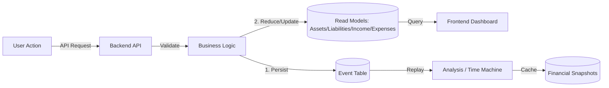

# Software Requirement Specification: RichFlow Financial Platform

| **Version** | 2.2.0 |
|-------------|-------|
| **Status** | Implementation Complete |
| **Architect** | Vince Latabe (AI Delegate) |
| **Date** | December 31, 2025 |

---

## 1. Introduction

### 1.1 Purpose

RichFlow is a financial literacy and management platform designed to help users escape the "Rat Race" by visualizing wealth velocity. Unlike traditional expense trackers, RichFlow utilizes an **Event-Sourced Architecture**. It does not merely store current balances; it records every financial decision as an immutable event, allowing for historical reconstruction ("Time Machine") and deep cashflow analysis based on Robert Kiyosaki's *Rich Dad Poor Dad* financial principles.

The platform exists to address a critical gap in financial literacy among individuals who lack structured guidance in understanding and managing their personal finances. By enabling users to track their income (Earned, Portfolio, Passive), expenses, assets, and liabilities in a structured manner, RichFlow helps them gain clarity on their current financial standing and visualize their trajectory toward the "Freedom Crossover" point.

### 1.2 Scope

The system encompasses:

- **Financial Engine**: An event-driven core that processes income, expenses, assets, liabilities, and cash savings.
- **Dashboard**: A read-optimized visualization layer for Income Statements and optional Balance Sheets.
- **Analysis (Time Machine)**: Point-in-time state exploration, historical snapshot comparison, and financial trajectory visualization.
- **Saki AI**: A Google Generative AI-integrated assistant providing context-aware financial coaching.
- **Admin Panel**: System oversight and user management with read-only financial data inspection.
- **Event Log**: A complete audit trail of all financial actions with filtering and search capabilities.
- **True Yield Engine**: Asset performance analytics with income/liability linking and tier-gated metrics.

### 1.3 Key Definitions

| Term | Definition |
|------|------------|
| **Asset** | Anything that puts money in the user's pocket (Cashflow Positive) |
| **Liability** | Anything that takes money out of the user's pocket (Cashflow Negative) |
| **Event** | An immutable record of a state change (e.g., `CREATE`, `UPDATE`, `DELETE` on entities) |
| **Projection** | The calculated state (Net Worth, Monthly Cashflow) derived from the sum of all previous events |
| **Income Quadrant** | Classification of income sources: Employee, Self-Employed, Business Owner, Investor |
| **Wealth Velocity** | The rate of net worth change over time |
| **Freedom Gap** | Total Expenses minus Passive/Portfolio Income; negative means financial freedom achieved |
| **Passive Coverage Ratio** | (Passive + Portfolio Income) / Total Expenses × 100% |
| **True Yield** | Actual performance metrics of an asset when linked to its income streams and liabilities |
| **Cap Rate** | Capitalization Rate = (Net Operating Income / Asset Value) × 100% |
| **Cash-on-Cash Return** | (Net Annual Cashflow / Equity) × 100% |
| **DSCR** | Debt Service Coverage Ratio = Net Operating Income / Annual Debt Service |
| **Subscription Tier** | User access level: FREE (basic features) or PRO (full True Yield metrics) |

---

## 2. System Architecture

### 2.1 High-Level Design

RichFlow utilizes a **Hybrid Event-Sourcing Pattern** with a "Snapshot + Delta" optimization strategy for historical state reconstruction.

| Layer | Description |
|-------|-------------|
| **Command Layer (Writes)** | Users generate events via CRUD operations. Events are validated, persisted to the Event table, and read models are updated atomically within a transaction. |
| **Projection Layer (Sync)** | Upon successful event storage, specific reducers (pure functions) update the mutable "Read Models" (Asset, Liability, IncomeLine, Expense, CashSavings) for instant UI feedback. |
| **Query Layer (Reads)** | The frontend requests data from Read Models for the Dashboard, ensuring O(1) read performance. |
| **Snapshot Layer (Optimization)** | Monthly checkpoints store serialized financial states, enabling faster historical reconstruction with minimal event replay. |

### 2.2 Tech Stack

| Category | Technology |
|----------|------------|
| **Frontend** | React 19 (Vite 7.x), TypeScript 5.9, Tailwind CSS 4.x, Recharts 3.x |
| **State Management** | TanStack React Query 5.x (server state), React Context (client state) |
| **Backend** | Node.js, Express 5.x, TypeScript |
| **Database** | PostgreSQL (via Prisma ORM v6.18+) |
| **Auth** | JWT Access Tokens + HttpOnly Cookie Refresh Tokens with Session-based management |
| **AI** | Google Generative AI (Gemini) for Saki Assistant |
| **Password Hashing** | bcrypt (12 salt rounds) |

### 2.3 Data Flow Diagram



### 2.4 Frontend Architecture

The frontend implements an **Intelligent Projection Consumer** pattern optimized for read-heavy financial dashboard operations.

#### 2.4.1 Derived State Pattern

Financial summary metrics (Net Worth, Cashflow, Freedom Gap) are computed client-side from cached atomic data (income, expenses, assets, liabilities) using `useMemo`. This ensures:

- **Zero Desynchronization**: Summary metrics always match the underlying transaction lists
- **No Additional API Endpoints**: Reduces backend maintenance burden
- **Instant Recalculation**: Cache invalidation triggers immediate recomputation without network requests

```
React Query Cache (Data Atoms)
┌─────────────┐ ┌─────────────┐ ┌─────────────┐
│   Income    │ │  Expenses   │ │   Assets    │
│   Cache     │ │   Cache     │ │   Cache     │
└──────┬──────┘ └──────┬──────┘ └──────┬──────┘
       └───────────────┼───────────────┘
                       ▼
       ┌───────────────────────────────┐
       │     useFinancialSummary()     │
       │   useMemo(() => {             │
       │     netWorth = assets - liab  │
       │     cashflow = income - exp   │
       │   }, [income, expenses, ...]) │
       └───────────────────────────────┘
```

#### 2.4.2 Caching Strategy (React Query)

| Configuration | Value | Purpose |
|--------------|-------|----------|
| **staleTime** | 5 minutes | Reduces server load; instant navigation between pages |
| **retry** | 1 | Single retry on transient failures |
| **refetchOnWindowFocus** | true | Ensures data freshness when user returns |

**Critical Rule**: Every mutation must explicitly invalidate affected queries to maintain cache consistency.

#### 2.4.3 Bundle Optimization (Code Splitting)

| Route | Loading | Justification |
|-------|---------|---------------|
| `/dashboard` | Eager | Primary user destination; critical path |
| `/analysis` | Lazy | Heavy charting libraries (Recharts) |
| `/user-guide` | Lazy | Documentation; rarely accessed |
| `/admin` | Lazy | Admin-only; small user base |
| `/event-log` | Lazy | Audit trail; secondary feature |

#### 2.4.4 Self-Healing Authentication

The `useApiClient` hook implements automatic token refresh on 401 responses:

1. Request fails with 401 Unauthorized
2. Automatically attempt token refresh via HttpOnly cookie
3. Retry original request with new access token
4. If refresh fails, clear token and trigger logout

Users experience seamless session continuity without manual re-authentication.

---

## 3. Functional Requirements

### 3.1 Module: Authentication & Identity

| ID | Requirement | Status |
|----|-------------|--------|
| **FR-01** | System must support email/password registration with unique username. | ✅ Implemented |
| **FR-02** | Passwords must be hashed using bcrypt (12 salt rounds). | ✅ Implemented |
| **FR-03** | Successful login returns a JWT Access Token and sets an HttpOnly refresh token cookie. | ✅ Implemented |
| **FR-04** | Each User must be initialized with a base Currency preference (Default: USD). | ✅ Implemented |
| **FR-05** | Users can update their username, email, and password. | ✅ Implemented |
| **FR-06** | Rate limiting must be applied to signup and login endpoints to prevent abuse. | ✅ Implemented |
| **FR-07** | Session-based authentication with database-backed token management. | ✅ Implemented |
| **FR-08** | Users can logout from current device or all devices (invalidate all sessions). | ✅ Implemented |

### 3.2 Module: Financial Event Engine (The Core)

| ID | Requirement | Status |
|----|-------------|--------|
| **FR-09** | **(Immutability)** Financial actions must be stored as events with actionType, entityType, entitySubtype, payload (beforeValue/afterValue), and timestamp. Events cannot be updated or deleted via API. | ✅ Implemented |

#### FR-10: Entity Types & Actions

| Entity Type | Supported Actions | Description |
|-------------|-------------------|-------------|
| `INCOME` | CREATE, UPDATE, DELETE | Income line entries with name, amount, type (Earned/Passive/Portfolio), and quadrant |
| `EXPENSE` | CREATE, UPDATE, DELETE | Expense entries with name and amount |
| `ASSET` | CREATE, UPDATE, DELETE | Asset entries with name and value |
| `LIABILITY` | CREATE, UPDATE, DELETE | Liability entries with name and value |
| `CASH_SAVINGS` | CREATE, UPDATE | User's cash savings amount |
| `USER` | CREATE, UPDATE | User profile changes including currency preferences |

#### FR-11: Automatic Event Logging

| Requirement | Description |
|-------------|-------------|
| All CRUD operations on financial entities automatically generate corresponding events | No manual event creation required |
| Events store both `beforeValue` and `afterValue` for UPDATE operations | Enables full audit trail |
| Events are created within the same database transaction as entity changes | Ensures data consistency |

### 3.3 Module: Dashboard & Projections

| ID | Requirement | Status |
|----|-------------|--------|
| **FR-12** | **(Income Statement)** Display Income Lines vs. Expenses with type categorization (Earned, Passive, Portfolio). | ✅ Implemented |
| **FR-13** | **(Balance Sheet - Optional)** Display Assets vs. Liabilities. Users can create and toggle visibility of Balance Sheet. | ✅ Implemented |
| **FR-14** | **(Cash Savings)** Display and manage user's current cash/savings amount in the Summary Section. | ✅ Implemented |
| **FR-15** | **(Cashflow)** Calculated as Total Income minus Total Expenses. | ✅ Implemented |
| **FR-16** | **(Net Worth)** Calculated as `Sum(Asset Values) + Cash Savings - Sum(Liability Values)`. | ✅ Implemented |
| **FR-17** | **(Wealth Velocity)** Net Worth change vs. previous month, both absolute and percentage. | ✅ Implemented |
| **FR-18** | **(Progress Bar)** Visual display of user's progress towards financial freedom (Passive + Portfolio Income vs. Total Expenses). | ✅ Implemented |

### 3.4 Module: Analysis (Time Machine)

| ID | Requirement | Status |
|----|-------------|--------|
| **FR-19** | **(Point-in-Time Snapshot)** Users can select any historical date via calendar picker. System reconstructs complete financial state for that date. | ✅ Implemented |
| **FR-20** | **(Snapshot Comparison)** Users can select start and end dates to generate a "Period Review" report showing changes. | ✅ Implemented |
| **FR-21** | **(Financial Trajectory)** Time-series visualization of key metrics over a date range with configurable intervals (daily/weekly/monthly). | ✅ Implemented |

#### FR-22: Snapshot Data Points

| Category | Metrics |
|----------|---------|
| **Balance Sheet** | Total Cash, Total Assets, Total Liabilities, Net Worth |
| **Cashflow** | Earned Income, Passive Income, Portfolio Income, Total Income, Total Expenses, Net Cashflow, Direction |
| **Ratios** | Passive Coverage Ratio, Savings Rate |
| **RichFlow Metrics** | Wealth Velocity, Wealth Velocity %, Solvency Ratio, Freedom Gap |
| **Income Quadrant** | Employee %, Self-Employed %, Business Owner %, Investor % (amount and percentage) |
| **Financial Health** | Runway (months), Freedom Date projection, Asset Efficiency, Net Worth Trend, Cashflow Trend |

#### FR-23: Trajectory Visualizations

| Chart | Description |
|-------|-------------|
| **Rat Race Escape** | Line chart plotting Total Expenses against Passive + Portfolio Income to identify "Freedom Crossover" |
| **Net Worth & Velocity** | Composite chart showing Net Worth trend with monthly Wealth Velocity |
| **Asset Efficiency (ROA)** | Trend line tracking Return on Assets percentage |
| **Quadrant Evolution** | Stacked area chart showing income distribution shift across quadrants |

### 3.5 Module: Saki AI Assistant

| ID | Requirement | Status |
|----|-------------|--------|
| **FR-24** | AI assistant accessible from Dashboard sidebar panel. | ✅ Implemented |
| **FR-25** | AI must have read-access to user's current financial data (income, expenses, cash savings, optionally balance sheet) to provide specific advice. | ✅ Implemented |
| **FR-26** | AI responses formatted as JSON with categorized insights: Income Analysis, Expense Behavior, Cashflow & Savings, Assets & Liabilities (if enabled), Financial Freedom Progress. | ✅ Implemented |
| **FR-27** | AI uses user's preferred currency symbol in all monetary references. | ✅ Implemented |

### 3.6 Module: Admin Panel

| ID | Requirement | Status |
|----|-------------|--------|
| **FR-28** | View list of all users with search by name, email, or ID. | ✅ Implemented |
| **FR-29** | View individual user details. | ✅ Implemented |
| **FR-30** | Delete users (with cascade delete of all related data). | ✅ Implemented |
| **FR-31** | Read-only view of specific user's financial data (balance sheet, income statement, cash savings) for support/debugging. | ✅ Implemented |
| **FR-32** | Admin routes protected by `requireAdmin` middleware. | ✅ Implemented |

### 3.7 Module: Event Log

| ID | Requirement | Status |
|----|-------------|--------|
| **FR-33** | Dedicated Event Log page displaying complete financial history. | ✅ Implemented |
| **FR-34** | Filter events by type (Income, Expense, Asset, Liability, Cash, User). | ✅ Implemented |
| **FR-35** | Filter events by date range. | ✅ Implemented |
| **FR-36** | Search events by name/description. | ✅ Implemented |
| **FR-37** | Infinite scroll pagination for efficient loading. | ✅ Implemented |
| **FR-38** | Historical currency display (shows currency symbol that was active at time of event). | ✅ Implemented |

### 3.8 Module: Currency Management

| ID | Requirement | Status |
|----|-------------|--------|
| **FR-39** | Predefined list of currencies available for selection. | ✅ Implemented |
| **FR-40** | Users can change their preferred currency. | ✅ Implemented |
| **FR-41** | Currency changes logged as USER UPDATE events. | ✅ Implemented |

### 3.9 Module: True Yield Engine

| ID | Requirement | Status |
|----|-------------|--------|
| **FR-42** | Users can link Income Lines to Assets to track income-generating performance. | ✅ Implemented |
| **FR-43** | Users can link Liabilities to Assets to track debt obligations against assets. | ✅ Implemented |
| **FR-44** | System calculates Cap Rate for linked assets (NOI / Asset Value). | ✅ Implemented |
| **FR-45** | System calculates Cash-on-Cash Return (Net Cashflow / Equity). | ✅ Implemented |
| **FR-46** | System calculates DSCR when debt exists (NOI / Annual Debt Service). | ✅ Implemented |
| **FR-47** | FREE tier users can link data but see blurred/locked metrics with upgrade CTA. | ✅ Implemented |
| **FR-48** | PRO tier users see full performance metrics and AI-powered insights. | ✅ Implemented |
| **FR-49** | All link/unlink operations are event-sourced with LINK/UNLINK action types. | ✅ Implemented |

#### FR-50: True Yield Metrics

| Metric | Formula | Description |
|--------|---------|-------------|
| **Annual Gross Income** | Sum of linked income × 12 | Total yearly income from asset |
| **Annual Debt Service** | Sum of linked liability payments × 12 | Total yearly debt obligations |
| **Net Operating Income (NOI)** | Annual Gross Income - Operating Expenses | Income after expenses |
| **Cap Rate** | (NOI / Asset Value) × 100% | Return relative to asset value |
| **Cash-on-Cash Return** | (Net Cashflow / Equity) × 100% | Return on invested capital |
| **DSCR** | NOI / Annual Debt Service | Ability to cover debt (null if no debt) |
| **Equity** | Asset Value - Linked Liabilities | Net ownership value |
| **Net Annual Cashflow** | NOI - Annual Debt Service | Cash remaining after debt |

#### FR-51: Performance Levels

| Level | Criteria |
|-------|----------|
| **Excellent** | Cash-on-Cash ≥ 12%, DSCR ≥ 1.5, Cap Rate ≥ 8% |
| **Good** | Cash-on-Cash ≥ 8%, DSCR ≥ 1.25, Cap Rate ≥ 6% |
| **Fair** | Cash-on-Cash ≥ 4%, DSCR ≥ 1.0, Cap Rate ≥ 4% |
| **Poor** | Below fair thresholds |
| **Locked** | FREE tier (metrics hidden) |

---

## 4. Data Models (Schema Specification)

Based on the Prisma implementation, the schema enforces the architecture.

### 4.1 Core Entities

#### User

| Field | Type | Description |
|-------|------|-------------|
| `id` | Int (Auto-increment, PK) | Unique identifier |
| `name` | String (Unique) | Display username |
| `email` | String (Unique) | User email address |
| `password` | String | Hashed password (bcrypt) |
| `isAdmin` | Boolean (Default: false) | Admin role flag |
| `subscriptionTier` | SubscriptionTier (Default: FREE) | User subscription level (FREE or PRO) |
| `preferredCurrencyId` | Int (FK → Currency, Default: 1) | User's currency preference |
| `createdAt` | DateTime | Account creation timestamp |
| `updatedAt` | DateTime | Last update timestamp |
| `lastLogin` | DateTime? | Last successful login |

**Relations:** Session[], BalanceSheet?, IncomeStatement?, CashSavings?, Event[], FinancialSnapshot[]

#### Session

| Field | Type | Description |
|-------|------|-------------|
| `id` | Int (Auto-increment, PK) | Unique identifier |
| `token` | String | Refresh token |
| `expiresAt` | DateTime | Token expiration |
| `createdAt` | DateTime | Session creation |
| `isValid` | Boolean (Default: true) | Session validity status |
| `userId` | Int (FK → User) | Owner reference |

**Purpose:** Manages HttpOnly cookie-based refresh token sessions with database-backed validation.

#### Event (The Source of Truth)

| Field | Type | Description |
|-------|------|-------------|
| `id` | Int (Auto-increment, PK) | Unique identifier |
| `timestamp` | DateTime | Event timestamp |
| `actionType` | String | CREATE, UPDATE, DELETE, LINK, UNLINK |
| `entityType` | String | INCOME, EXPENSE, ASSET, LIABILITY, CASH_SAVINGS, USER |
| `entitySubtype` | String? | Optional subtype (e.g., INCOME_STATEMENT) |
| `userId` | Int (FK → User) | Owner reference |
| `entityId` | Int | Reference to affected entity |
| `beforeValue` | Json? | State before change |
| `afterValue` | Json? | State after change |

**Indexes:** userId, entityType, entityId, (userId, timestamp)

#### IncomeStatement (Read Model Container)

| Field | Type | Description |
|-------|------|-------------|
| `id` | Int (Auto-increment, PK) | Unique identifier |
| `userId` | Int (FK → User, Unique) | Owner reference |

**Relations:** IncomeLine[], Expense[]

**Note:** Automatically created during user registration.

#### IncomeLine (Read Model)

| Field | Type | Description |
|-------|------|-------------|
| `id` | Int (Auto-increment, PK) | Unique identifier |
| `name` | String | Income source name |
| `amount` | Decimal(15,2) | Monthly income amount |
| `type` | String | EARNED, PASSIVE, or PORTFOLIO |
| `quadrant` | String? | EMPLOYEE, SELF_EMPLOYED, BUSINESS_OWNER, or INVESTOR |
| `isId` | Int (FK → IncomeStatement) | Parent reference |
| `assetId` | Int? (FK → Asset) | Optional link to generating asset (True Yield) |

#### Expense (Read Model)

| Field | Type | Description |
|-------|------|-------------|
| `id` | Int (Auto-increment, PK) | Unique identifier |
| `name` | String | Expense name |
| `amount` | Decimal(15,2) | Monthly expense amount |
| `isId` | Int (FK → IncomeStatement) | Parent reference |

#### BalanceSheet (Read Model Container)

| Field | Type | Description |
|-------|------|-------------|
| `id` | Int (Auto-increment, PK) | Unique identifier |
| `userId` | Int (FK → User, Unique) | Owner reference |

**Relations:** Asset[], Liability[]

**Note:** Created on-demand when user enables Balance Sheet tracking.

#### Asset (Read Model)

| Field | Type | Description |
|-------|------|-------------|
| `id` | Int (Auto-increment, PK) | Unique identifier |
| `name` | String | Asset name |
| `value` | Decimal(15,2) | Current asset value |
| `bsId` | Int (FK → BalanceSheet) | Parent reference |

**Relations:** IncomeLine[] (linked income streams), Liability[] (linked liabilities)

**True Yield:** Assets can be linked to income streams and liabilities to calculate performance metrics.

#### Liability (Read Model)

| Field | Type | Description |
|-------|------|-------------|
| `id` | Int (Auto-increment, PK) | Unique identifier |
| `name` | String | Liability name |
| `value` | Decimal(15,2) | Current liability amount |
| `bsId` | Int (FK → BalanceSheet) | Parent reference |
| `assetId` | Int? (FK → Asset) | Optional link to financed asset (True Yield) |

#### CashSavings (Read Model)

| Field | Type | Description |
|-------|------|-------------|
| `id` | Int (Auto-increment, PK) | Unique identifier |
| `amount` | Decimal(15,2) (Default: 0) | Current cash/savings amount |
| `userId` | Int (FK → User, Unique) | Owner reference |

**Note:** Automatically created during user registration with amount 0.

#### Currency

| Field | Type | Description |
|-------|------|-------------|
| `id` | Int (Auto-increment, PK) | Unique identifier |
| `cur_symbol` | String | Currency symbol (e.g., $, €, ₱) |
| `cur_name` | String | Currency name/code (e.g., USD, EUR, PHP) |

**Relations:** User[] (users with this preference)

#### FinancialSnapshot (Time Machine Cache)

| Field | Type | Description |
|-------|------|-------------|
| `id` | UUID (PK) | Unique identifier |
| `userId` | Int (FK → User) | Owner reference |
| `date` | DateTime | Snapshot date |
| `data` | Json | Serialized financial state |
| `createdAt` | DateTime | Creation timestamp |

**Index:** (userId, date)

**Purpose:** Caches historical states for fast point-in-time reconstruction. Monthly checkpoints are auto-generated to limit event replay depth.

**Snapshot Data Structure:**
```json
{
  "assets": [[id, { "id": number, "name": string, "value": number }], ...],
  "liabilities": [[id, { "id": number, "name": string, "value": number }], ...],
  "incomeLines": [[id, { "id": number, "name": string, "amount": number, "type": string, "quadrant": string|null }], ...],
  "expenses": [[id, { "id": number, "name": string, "amount": number }], ...],
  "cashSavings": number,
  "currency": { "symbol": string, "name": string }
}
```

---

## 5. API Interface Specifications

### 5.1 Authentication (`/api/auth`)

| Method | Endpoint | Description | Auth |
|--------|----------|-------------|------|
| `POST` | `/signup` | Create new account (name, email, password) | Public |
| `POST` | `/login` | Authenticate and receive tokens | Public |
| `POST` | `/refresh` | Refresh access token via cookie | Public (requires refresh cookie) |
| `POST` | `/logout` | Invalidate current session | Public |
| `POST` | `/logout-all` | Invalidate all user sessions | Private |
| `GET` | `/profile` | Get current user profile | Private |
| `PUT` | `/username` | Update username | Private |
| `PUT` | `/email` | Update email | Private |
| `PUT` | `/password` | Update password | Private |

**Login Response:**
```json
{
  "message": "Login successful",
  "accessToken": "jwt...",
  "user": { "id": 1, "name": "...", "email": "...", "isAdmin": false }
}
```

### 5.2 Income (`/api/income`)

| Method | Endpoint | Description | Auth |
|--------|----------|-------------|------|
| `GET` | `/` | Get all income lines | Private |
| `POST` | `/` | Add new income line | Private |
| `PUT` | `/:id` | Update income line | Private |
| `DELETE` | `/:id` | Delete income line | Private |

**Request Body (POST/PUT):**
```json
{
  "name": "Salary",
  "amount": 5000,
  "type": "EARNED",
  "quadrant": "EMPLOYEE"
}
```

### 5.3 Expenses (`/api/expenses`)

| Method | Endpoint | Description | Auth |
|--------|----------|-------------|------|
| `GET` | `/` | Get all expenses | Private |
| `POST` | `/` | Add new expense | Private |
| `PUT` | `/:id` | Update expense | Private |
| `DELETE` | `/:id` | Delete expense | Private |

### 5.4 Balance Sheet (`/api`)

| Method | Endpoint | Description | Auth |
|--------|----------|-------------|------|
| `GET` | `/balance-sheet` | Get user's balance sheet | Private |
| `POST` | `/balance-sheet` | Create balance sheet | Private |
| `GET` | `/assets` | Get all assets | Private |
| `POST` | `/assets` | Add new asset | Private |
| `PUT` | `/assets/:id` | Update asset | Private |
| `DELETE` | `/assets/:id` | Delete asset | Private |
| `GET` | `/liabilities` | Get all liabilities | Private |
| `POST` | `/liabilities` | Add new liability | Private |
| `PUT` | `/liabilities/:id` | Update liability | Private |
| `DELETE` | `/liabilities/:id` | Delete liability | Private |

### 5.5 Cash Savings (`/api/cash-savings`)

| Method | Endpoint | Description | Auth |
|--------|----------|-------------|------|
| `GET` | `/` | Get current cash savings | Private |
| `PUT` | `/` | Update cash savings amount | Private |

### 5.6 Events (`/api/events`)

| Method | Endpoint | Description | Auth |
|--------|----------|-------------|------|
| `GET` | `/` | Get events with filters (entityType, startDate, endDate, limit, offset, search) | Private |
| `GET` | `/:entityType/:entityId` | Get events for specific entity | Private |
| `PUT` | `/:id` | **BLOCKED** - Events are immutable | Private |
| `PATCH` | `/:id` | **BLOCKED** - Events are immutable | Private |
| `DELETE` | `/:id` | **BLOCKED** - Events are immutable | Private |

### 5.7 Analysis (`/api/analysis`)

| Method | Endpoint | Description | Auth |
|--------|----------|-------------|------|
| `GET` | `/snapshot` | Get financial snapshot (optional `date` query param for historical) | Private |
| `GET` | `/trajectory` | Get financial trajectory (startDate, endDate, interval query params) | Private |
| `POST` | `/snapshot` | Manually trigger snapshot creation | Private |

**Snapshot Response:**
```json
{
  "date": "2025-12-26",
  "currency": { "symbol": "$", "name": "USD" },
  "balanceSheet": { "totalCashBalance": 10000, "totalAssets": 50000, "totalLiabilities": 20000, "netWorth": 40000 },
  "cashflow": { "earnedIncome": 5000, "passiveIncome": 500, "portfolioIncome": 200, "totalIncome": 5700, "totalExpenses": 3000, "netCashflow": 2700, "direction": "positive" },
  "ratios": { "passiveCoverageRatio": "23.33", "savingsRate": "47.37" },
  "richFlowMetrics": { "wealthVelocity": 2000, "wealthVelocityPct": 5.26, "solvencyRatio": 33.33, "freedomGap": 2300 },
  "incomeQuadrant": { "EMPLOYEE": { "amount": 5000, "pct": 87.72 }, ... },
  "financialHealth": { "runway": 3.3, "freedomDate": "2030-06-15", "assetEfficiency": 1.4, "trends": { "netWorth": 5.2, "cashflow": 2.1 } }
}
```

### 5.8 AI (`/api/ai`)

| Method | Endpoint | Description | Auth |
|--------|----------|-------------|------|
| `GET` | `/showinformation` | Get AI-generated financial analysis | Private |

### 5.9 True Yield (`/api/analysis/true-yield`)

| Method | Endpoint | Description | Auth |
|--------|----------|-------------|------|
| `GET` | `/assets/:assetId` | Get asset performance metrics | Private |
| `GET` | `/assets` | Get all assets with yield summaries | Private |
| `GET` | `/linkable/income` | Get income lines available for linking | Private |
| `GET` | `/linkable/liabilities` | Get liabilities available for linking | Private |
| `POST` | `/link/income` | Link income line to asset | Private |
| `DELETE` | `/unlink/income` | Unlink income line from asset | Private |
| `POST` | `/link/liability` | Link liability to asset | Private |
| `DELETE` | `/unlink/liability` | Unlink liability from asset | Private |

**Asset Performance Response (PRO tier):**
```json
{
  "isPro": true,
  "asset": { "id": 1, "name": "Rental Property", "value": 280000 },
  "linkedIncomeLines": [{ "id": 1, "name": "Rental Income", "amount": 2400, "type": "PASSIVE" }],
  "linkedLiabilities": [{ "id": 1, "name": "Mortgage", "value": 210000 }],
  "metrics": {
    "annualGrossIncome": 28800,
    "annualDebtService": 17400,
    "netOperatingIncome": 24000,
    "capRate": 8.57,
    "cashOnCashReturn": 9.43,
    "debtServiceCoverageRatio": 1.38,
    "equity": 70000,
    "netAnnualCashflow": 6600
  },
  "summary": {
    "performanceLevel": "good",
    "recommendation": "This asset is performing well..."
  }
}
```

**Asset Performance Response (FREE tier):**
```json
{
  "isPro": false,
  "asset": { "id": 1, "name": "Rental Property", "value": 280000 },
  "linkedIncomeLines": [...],
  "linkedLiabilities": [...],
  "metrics": null,
  "summary": { "performanceLevel": "locked", "recommendation": "Upgrade to PRO..." }
}
```

### 5.10 Currency (`/api/currency`)

| Method | Endpoint | Description | Auth |
|--------|----------|-------------|------|
| `GET` | `/` | Get all available currencies | Public |
| `GET` | `/user` | Get user's preferred currency | Private |
| `PUT` | `/user` | Update user's preferred currency | Private |

### 5.11 Admin (`/api/admin`)

| Method | Endpoint | Description | Auth |
|--------|----------|-------------|------|
| `GET` | `/users` | Get all users | Admin |
| `GET` | `/users/:id` | Get single user | Admin |
| `GET` | `/users/:id/financial` | Get user's financial data | Admin |
| `DELETE` | `/users/:id` | Delete user (cascade) | Admin |

---

## 6. Non-Functional Requirements

### 6.1 Performance

#### Backend Performance

| Metric | Requirement | Implementation |
|--------|-------------|----------------|
| **Dashboard Latency** | Load time < 800ms | Read models provide O(1) query performance |
| **Concurrency** | Event writes must be atomic | Prisma transactions ensure consistency |
| **Historical Reconstruction** | < 2 seconds for any point-in-time snapshot | "Snapshot + Delta" pattern limits event replay; monthly checkpoints cached |
| **Trajectory Generation** | Support up to 5 years of data points | Efficient aggregation with configurable intervals |

#### Frontend Performance

| Metric | Requirement | Implementation |
|--------|-------------|----------------|
| **Time to Interactive** | < 1 second | Eager loading of Dashboard; lazy loading of secondary routes |
| **Page Navigation** | Instant (< 100ms) | 5-minute stale time prevents redundant API calls |
| **Summary Recalculation** | Zero network cost | Derived State pattern with `useMemo` |
| **Initial Bundle** | < 100KB | Code splitting reduces critical path size |
| **Data Consistency** | Automatic | Mutation invalidation ensures cache-UI sync |

### 6.2 Security

| Aspect | Implementation |
|--------|----------------|
| **Password Security** | bcrypt hashing with 12 salt rounds |
| **Authentication** | JWT Access Tokens (short-lived) + HttpOnly Refresh Token Cookies (30-day expiry) |
| **Session Management** | Database-backed sessions with validity tracking; logout invalidates tokens |
| **Token Storage** | Access tokens stored in memory (not localStorage) to prevent XSS exposure |
| **Data Isolation** | Row-Level Security logic in application layer—Users can only query entities where `userId` matches token |
| **Input Validation** | All inputs validated via Zod schemas before processing |
| **Rate Limiting** | Applied to sensitive endpoints (signup, login) to prevent brute-force attacks |
| **CORS** | Configured for specific frontend origins with credentials support |
| **Admin Access** | Protected by `requireAdmin` middleware; admin flag stored in database |
| **Error Boundaries** | React Error Boundaries isolate component failures; prevents white screen of death |

### 6.3 Maintainability

| Aspect | Implementation |
|--------|----------------|
| **Type Safety** | Strict TypeScript throughout frontend and backend |
| **Backend Modular Architecture** | Controllers → Services → Domain functions separation |
| **Frontend Hook Architecture** | Custom hooks encapsulate data fetching (e.g., `useIncome`, `useExpenses`, `useFinancialSummary`) |
| **Pure Reducers** | Financial state reconstruction uses pure functions isolated from DB layer |
| **Event Immutability** | API blocks PUT/PATCH/DELETE on events; ensures audit trail integrity |
| **Snapshot Serialization** | State serialized to JSON for storage; hydration functions restore Map structures |
| **Context Isolation** | `AuthContext` and `CurrencyContext` separate auth and preferences from component logic |
| **API Client Abstraction** | `useApiClient` hook centralizes HTTP requests with auth handling |

### 6.4 Scalability

| Aspect | Implementation |
|--------|----------------|
| **Monthly Checkpoints** | Auto-generated snapshots limit event replay depth for long-term users |
| **Pagination** | Events API supports limit/offset; Event Log uses infinite scroll |
| **Indexed Queries** | Events indexed on userId, entityType, entityId, and (userId, timestamp) |

---

## 7. Implementation Roadmap

### Phase 1: Foundation ✅ Complete

- [x] Database Schema Design (Prisma)
- [x] User, Session, Currency models
- [x] IncomeStatement, IncomeLine, Expense models
- [x] BalanceSheet, Asset, Liability models
- [x] CashSavings model
- [x] Event model with immutability constraints
- [x] FinancialSnapshot model for Time Machine caching
- [x] Basic Auth API (signup, login, logout, refresh tokens)
- [x] Rate limiting on auth endpoints
- [x] JWT + HttpOnly cookie authentication

### Phase 2: Core Financial Engine ✅ Complete

- [x] Event Logging Service (automatic event creation on CRUD)
- [x] Pure Reducer Functions (assetReducer, liabilityReducer, incomeReducer, expenseReducer, cashSavingsReducer, userReducer)
- [x] Root Reducer for dispatching to entity-specific reducers
- [x] State reconstruction from events (`reconstructStateFromEvents`)
- [x] Snapshot + Delta optimization pattern
- [x] Monthly checkpoint auto-generation (`ensureMonthlyCheckpoints`)
- [x] Snapshot serialization/hydration for Map structures

### Phase 3: Dashboard & CRUD ✅ Complete

- [x] Income Lines CRUD with event logging
- [x] Expenses CRUD with event logging
- [x] Balance Sheet creation and toggle
- [x] Assets CRUD with event logging
- [x] Liabilities CRUD with event logging
- [x] Cash Savings management
- [x] Currency preference management
- [x] Dashboard UI with Income Statement view
- [x] Optional Balance Sheet display
- [x] Summary Section with key metrics

### Phase 4: Intelligence & Analysis ✅ Complete

- [x] Saki AI Integration (Google Generative AI / Gemini)
- [x] AI-powered financial analysis with categorized insights
- [x] Analysis Page with Time Machine features
- [x] Point-in-Time Snapshot exploration
- [x] Historical Snapshot Comparison
- [x] Financial Trajectory visualization
- [x] Wealth Velocity calculation
- [x] Freedom Gap and Freedom Date projection
- [x] Income Quadrant distribution
- [x] Asset Efficiency (ROA) tracking
- [x] Recharts visualizations (Line, Area, Composed, Pie charts)

### Phase 4.5: Frontend Architecture Optimization ✅ Complete

- [x] Migration from Webpack to Vite 7.x for faster builds
- [x] React Query integration with 5-minute stale time caching
- [x] Derived State pattern (`useFinancialSummary` hook) for zero-cost metrics
- [x] Code splitting with lazy loading for non-critical routes
- [x] Self-healing authentication (automatic token refresh)
- [x] Error Boundaries for graceful degradation
- [x] Custom hook architecture (`useIncome`, `useExpenses`, `useBalanceSheet`, etc.)
- [x] Centralized API client with interceptors (`useApiClient`)
- [x] Context providers for auth and currency state

### Phase 5: Administration & Audit ✅ Complete

- [x] Admin Panel with user list
- [x] User search and filtering
- [x] Admin user financial data view (read-only)
- [x] User deletion (cascade)
- [x] Event Log page with filtering
- [x] Event search functionality
- [x] Infinite scroll pagination
- [x] Historical currency display in events

### Phase 6: User Experience Enhancements ✅ Complete

- [x] User profile management (username, email, password updates)
- [x] Multi-device logout
- [x] Responsive design
- [x] Loading states and error handling
- [x] Landing page
- [x] User Guide page

### Phase 7: True Yield Engine ✅ Complete

- [x] Subscription Tier system (FREE/PRO enum)
- [x] Asset-IncomeLine linking (many-to-one relationship)
- [x] Asset-Liability linking (many-to-one relationship)
- [x] True Yield Service with performance metric calculations
- [x] Cap Rate, Cash-on-Cash Return, DSCR, NOI, Equity metrics
- [x] Tier-gated access (FREE sees blurred, PRO sees full metrics)
- [x] LINK/UNLINK event types for audit trail
- [x] TrueYieldCard component with performance visualization
- [x] AssetLinkingModal for managing asset connections
- [x] React Query hooks for True Yield data fetching
- [x] Performance level classification (excellent/good/fair/poor)
- [x] PRO/FREE test user seed files for demonstration

---

## 8. Out of Scope

The following features are explicitly excluded from the current project scope:

- Predictive analytics or machine learning-based financial forecasting
- Integration with real financial systems (banking APIs, stock market, cryptocurrency)
- Real-money transactions, payments, or investments
- Multi-user/family shared accounts
- Mobile native applications (web-responsive only)
- Data export/import functionality
- Recurring transaction automation

---

## 9. Conclusion

RichFlow is **not a CRUD app**; it is a **financial ledger system**. This SRS documents the complete implementation that adheres to the Event-Sourced model, ensuring validity and auditability take precedence over convenience. The platform successfully translates Robert Kiyosaki's *Rich Dad Poor Dad* financial principles into an interactive web application, empowering users to visualize their financial position, understand wealth-building fundamentals via the "Cashflow Quadrant," and track their progress toward financial independence.

The frontend architecture has been optimized as an **Intelligent Projection Consumer**, implementing the Derived State pattern to ensure mathematical consistency between summary metrics and underlying data. With React Query's caching strategy, code splitting, and self-healing authentication, the application delivers a fast, resilient, and seamless user experience.

By combining a robust event-sourcing backend with an optimized React frontend, intuitive visualizations, and AI-powered insights, RichFlow ensures that as users grow their wealth, the system scales its integrity alongside them.
